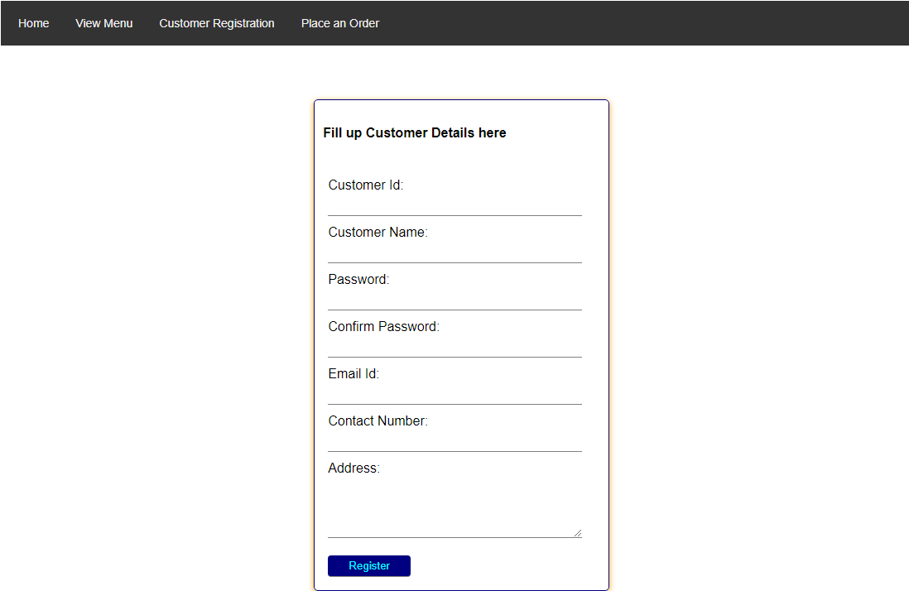
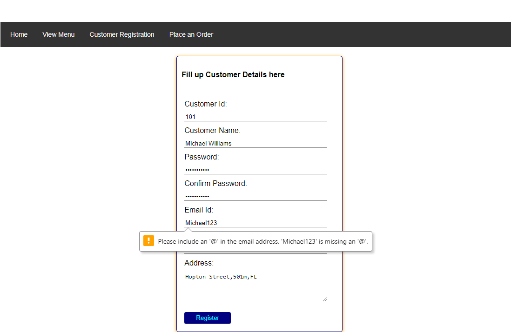
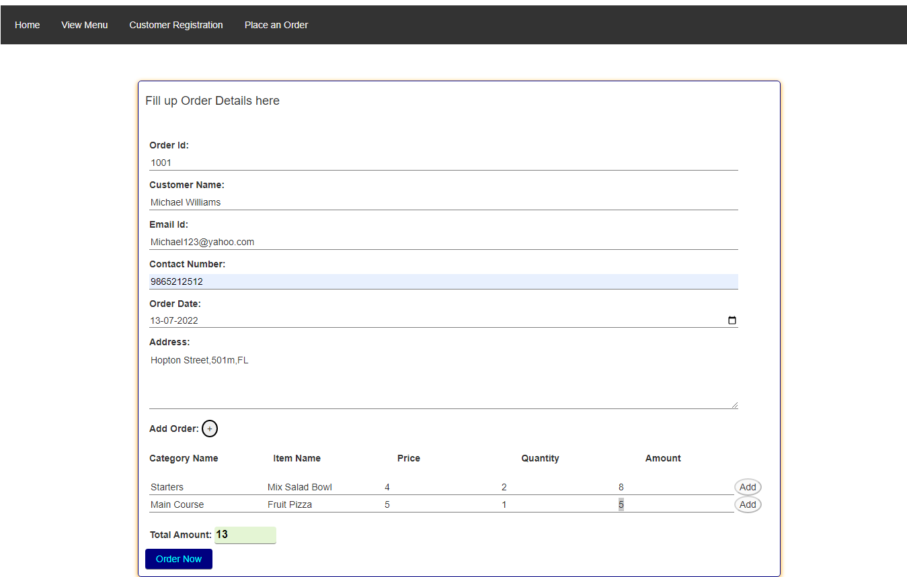

## Challenge - Wat-a-Pizza

#### Problem Statement

Wat-a-pizza, a pizza delivery outlet, became popular for its custom-made vegetarian pizzas. 

A customer can order pizzas and other accompaniments over the phone. The outlet delivers the orders received ​on call to the address given by the customers.​

​Wat-a-Pizza app allows the outlet call executive ​to enter the customer’s order details ​and persist them for future reference.​

#### Context 

Wat-a-pizza app allows the call executives to view the menu details and help the customers to place orders on call.​

The app allows the call executive to register new customers based on the information shared on the call that can be persisted in the database.​

The app should also allow the outlet team to capture orders and persist them in a database for future reference.​

The order form should allow the operator to persist the customer details, and items ordered and show the total amount that the customer should pay.

#### Task 1 – View Menu details

- The outlet team should be able to view the entire menu details on the app to place an order.​

- On clicking the "View Menu", the menu details should be fetched from the server using Axios API.​

- Selected menu items should be listed when a particular category is selected, e.g. starters.​

  * After fetching the menu details and storing in an array, use `filter()` to achieve.

#### Task 2 – Register a Customer 

- The outlet team can register a new customer using the app as per the details listed.​

- All the following listed validations should be applied on the registration form fields and display the error message for the field inputs which do not fulfil the validation criteria.​

- The form with invalid inputs should not get submitted.​

- Valid customer details should be saved to the `json-server` using Axios API. ​

| Input Field  | Validation Requirement |
| - | - |
| Customer Id​ | Should not be left blank​ |
| Customer Name​ |Should not be left blank ​|
| Password​ |Should not be left blank and have min 8 characters​ |
| Confirm password​ | Should be same as password value​ |
| Customer Email​ | Should not be left blank and should allow input of type email​ |
| Customer Phone​ | Should not be left blank and should allow valid phone number pattern​ |
| Customer Address​ | Should not be left blank​

#### Task 3 – Save an Order

- The Order form created in the previous sprint exercise should be reused here. ​

- As the user enters order items, the text field for “Total Amount” should get continuously updated with the sum of amount of all order items​

- When the user clicks on “Save Order” button, the complete order with all the details should be captured.​

- Persist the captured order details in the `json-server` using Axios API calls.​

- The order details with the customer details should be displayed on the web page once the transaction is successfully completed.

#### Instructions for Challenge

- Author the code in `menu.js` file to get the menu details from `json-server` using Axios API. ​

- Edit the code in `customer.html` to add the required HTML5 validations.​

- Author the code in `customer.js` to store the customer details using Axios API.​

- Author the code in `order.js` to capture and store the order details in `json-server` using Axios API.​

- Reuse the code developed in the previous sprint challenge to create the order form.(`order.html`)​

- All JavaScript (.js) files are located inside `js` folder​

- Start json-server for menu, customer and order to manipulate data from `menu.json`, `customer.json`, `order.json` respectively located under `json` folder.​

- Use different port numbers for each `json-server`. Eg. 3000, 3001 and 3002.​

- Open the `index.html` file using Live Server and test the expected output.

 

​

​

